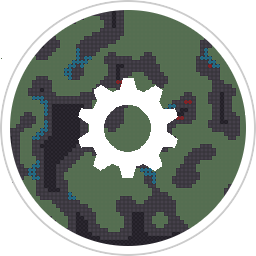

# AutoBotnet

**AutoBotnet - The Game**

## Documentation

- Server REST API documentation can be found in [doc](doc/).

## Design

Design information can be found in [AutoBotnetDesign](https://github.com/CookieEaters/AutoBotnetDesign).

## Hacking

- Install latest .NET Core tooling/sdk
  - As of the time of writing: [this version](https://github.com/dotnet/core/blob/master/release-notes/download-archives/2.0.5-download.md)
- Clone the repository recursively (`git clone --recursive https://github.com/CookieEaters/AutoBotnet.git`)
- Open `src/server` in your editor (vscode recommended)
- Restore `dotnet` dependencies: `dotnet restore` in `src/server`
- Everything is preconfigured so you can get started right away, default keybindings are <kbd>F5</kbd> to debug, <kbd>Ctrl</kbd>+<kbd>Shift</kbd>+<kbd>B</kbd> to build.
- For script build, use `./script/build.sh` with development dependencies
already installed. This is used in our CI pipeline.

### Docker

`Speercs.Server` has full support for running in Docker. You will have to link in config files using Docker volumes.

Here is an example, running `speercs` in Docker using the development configuration file:

- `docker run --name AutoBotnetLocalDev -p 5000:80 -v $(pwd)/src/server/Speercs.Server/speercs.json:/app/speercs.json speercs`
    - This will forward speercs's port 80 to the local system's port 5000, and link the config file to `/app/speercs.json`.
    - Use `docker create` to create the container without starting it immediately.
- `docker start AutoBotnetLocalDev` and `docker stop AutoBotnetLocalDev` to start/stop the container.

## Useful Commands
- Run server in development mode: `dotnet run --no-restore ENVIRONMENT=Development`

# License

Copyright © 2017 The CookieEaters. All Rights Reserved.

The source code of AutoBotnet is licensed under the **AGPLv3**, which can
be found in `LICENSE`.

Art and assets are licensed under the **CC BY-SA 4.0**.

Additional information is available in `CREDITS.md`.
